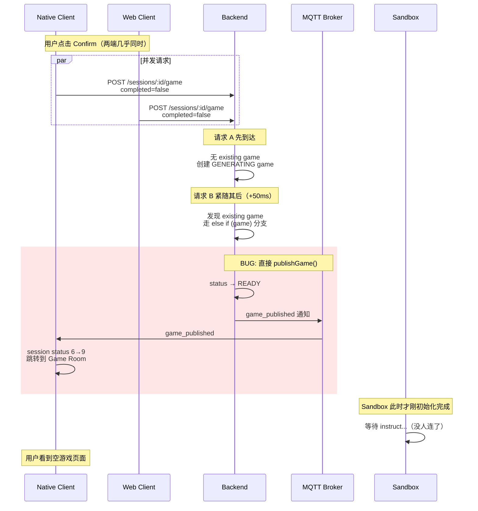
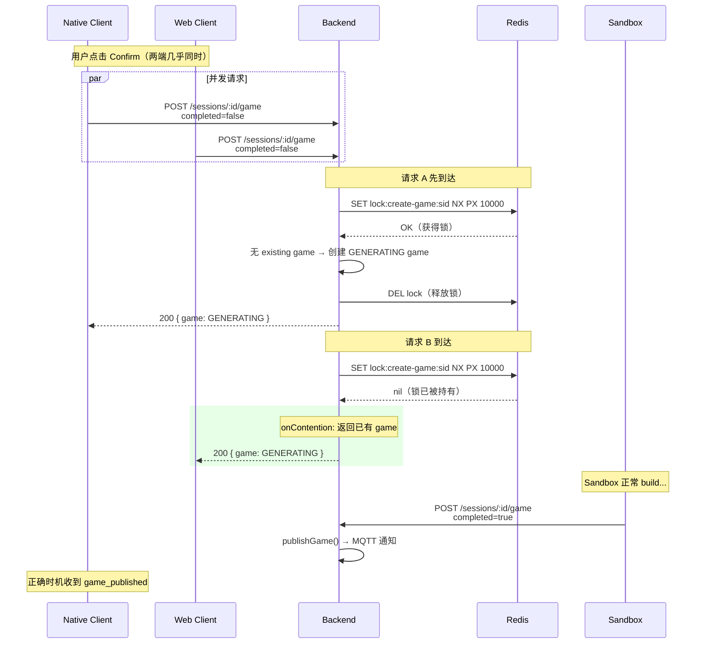

# 并发 createGame 竞态条件 — 时序图

## Bug 场景：请求 B 误发布空游戏

```mermaid
sequenceDiagram
    participant N as Native Client
    participant W as Web Client
    participant B as Backend
    participant MQ as MQTT Broker
    participant SB as Sandbox

    Note over N,W: 用户点击 Confirm（两端几乎同时）

    par 并发请求
        N->>B: POST /sessions/:id/game<br/>completed=false
        W->>B: POST /sessions/:id/game<br/>completed=false
    end

    Note over B: 请求 A 先到达
    B->>B: 无 existing game<br/>创建 GENERATING game

    Note over B: 请求 B 紧随其后（+50ms）
    B->>B: 发现 existing game<br/>走 else if (game) 分支

    rect rgb(255, 230, 230)
        Note over B,MQ: BUG: 直接 publishGame()
        B->>B: status → READY
        B->>MQ: game_published 通知
        MQ->>N: game_published
        N->>N: session status 6→9<br/>跳转到 Game Room
    end

    Note over SB: Sandbox 此时才刚初始化完成
    SB->>SB: 等待 instruct...（没人连了）

    Note over N: 用户看到空游戏页面
```

## 修复后：Redis 锁 + 文件检查

```mermaid
sequenceDiagram
    participant N as Native Client
    participant W as Web Client
    participant B as Backend
    participant R as Redis
    participant SB as Sandbox

    Note over N,W: 用户点击 Confirm（两端几乎同时）

    par 并发请求
        N->>B: POST /sessions/:id/game<br/>completed=false
        W->>B: POST /sessions/:id/game<br/>completed=false
    end

    Note over B,R: 请求 A 先到达
    B->>R: SET lock:create-game:sid NX PX 10000
    R-->>B: OK（获得锁）
    B->>B: 无 existing game → 创建 GENERATING game
    B->>R: DEL lock（释放锁）
    B-->>N: 200 { game: GENERATING }

    Note over B,R: 请求 B 到达
    B->>R: SET lock:create-game:sid NX PX 10000
    R-->>B: nil（锁已被持有）

    rect rgb(230, 255, 230)
        Note over B: onContention: 返回已有 game
        B-->>W: 200 { game: GENERATING }
    end

    Note over SB: Sandbox 正常 build...
    SB->>B: POST /sessions/:id/game<br/>completed=true
    B->>B: publishGame() → MQTT 通知
    Note over N: 正确时机收到 game_published
```

## Related
- [[concurrent-api-premature-publish]] - 详细的 Bug 分析和修复方案
