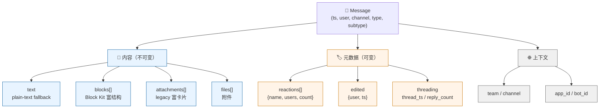
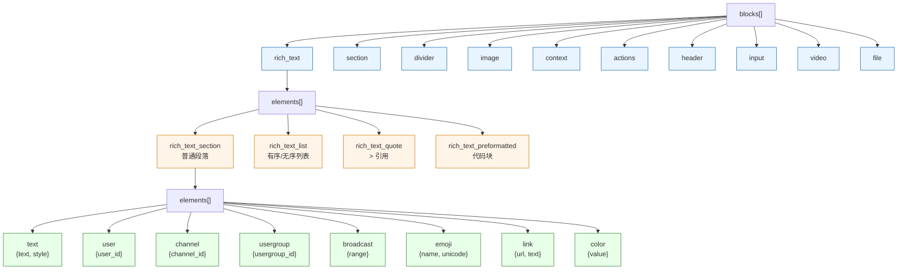
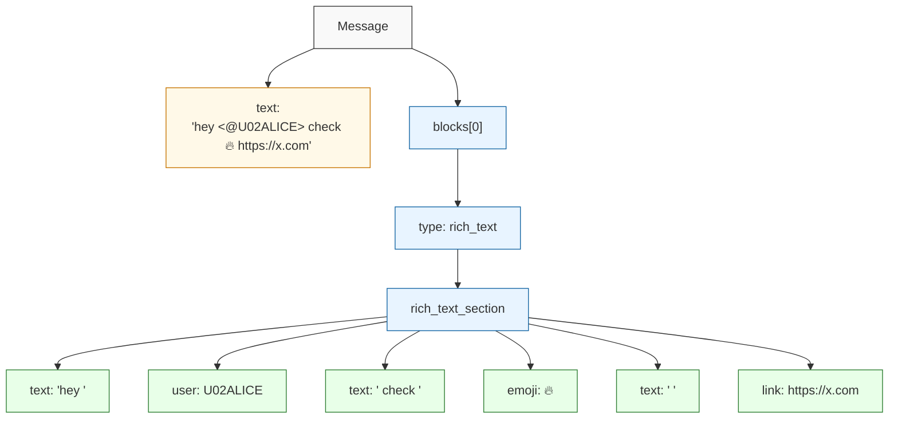
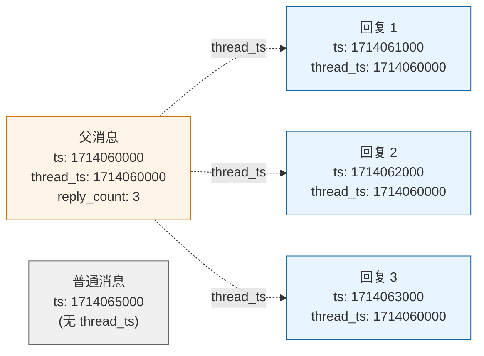
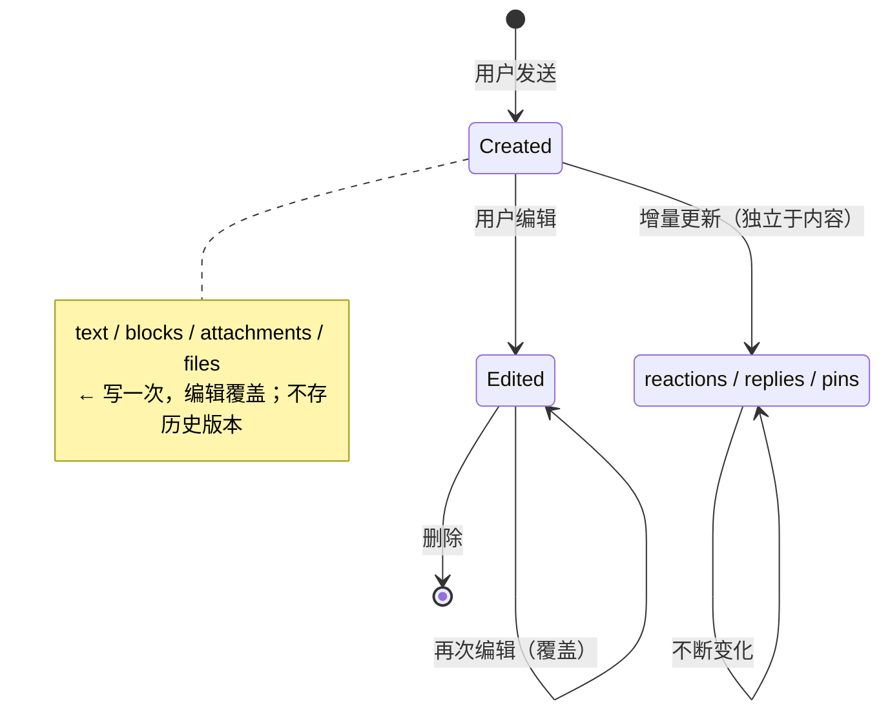

# Slack 消息数据结构树（可视化）

配套：[[slack-message-data-design]]

## 顶层结构

## blocks 三层结构

## 一条富文本消息的完整解析

> `hey @alice check 🔥 https://x.com`

## threading 的平铺存储

> 都在同一个 messages collection，按 `thread_ts` 分组就是 thread。

## 内容 vs 元数据：何时变

## Related

- [[slack-message-data-design]] - 详细文字版
