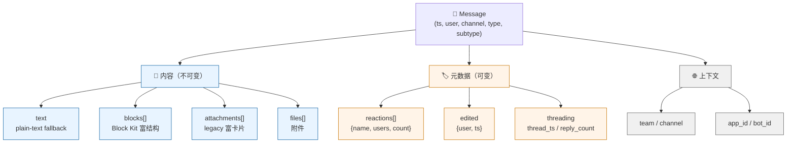
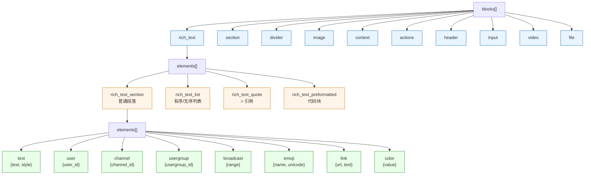
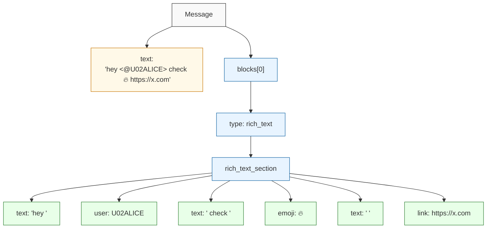
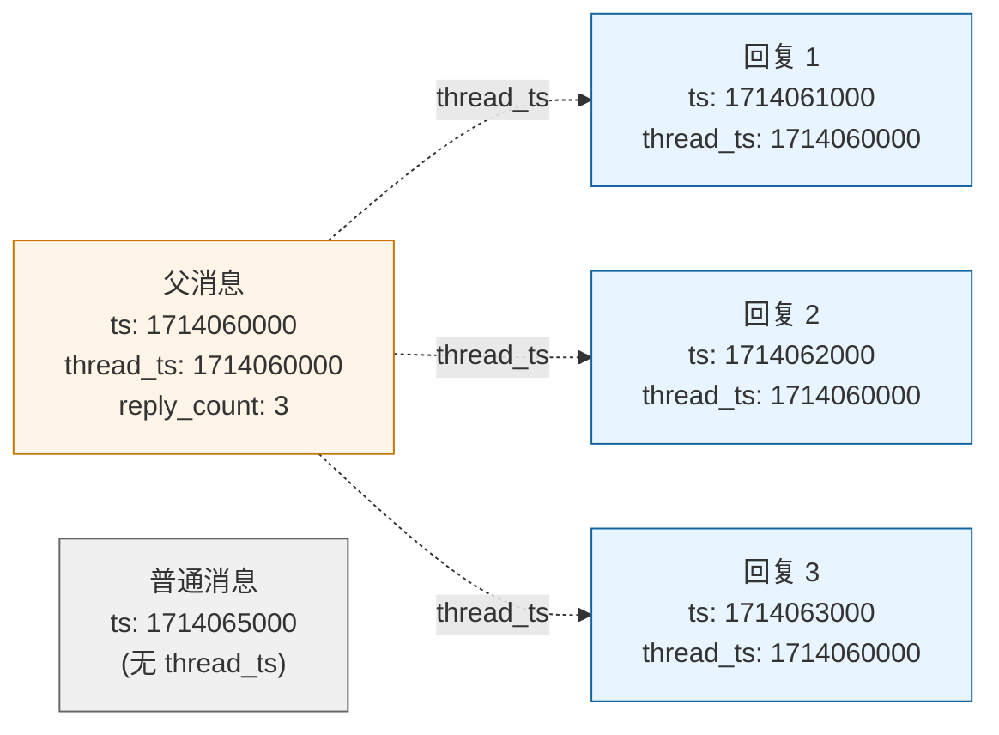
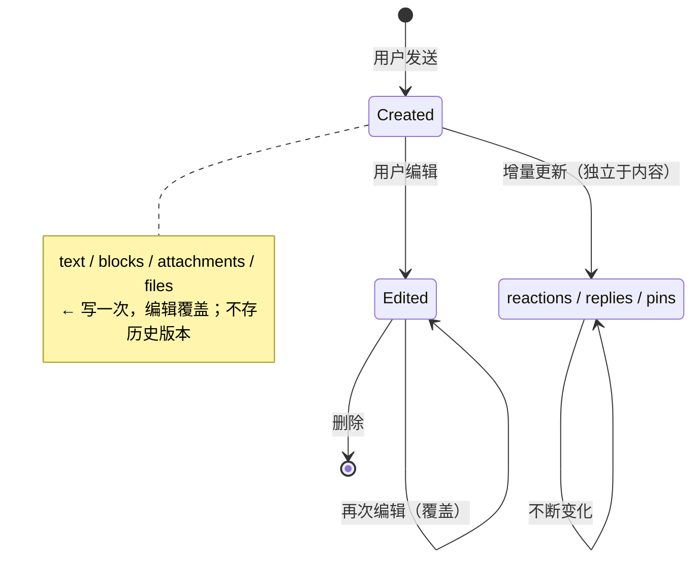

# Slack 消息数据模型完整设计

记录 Slack 的整套消息数据结构 —— 不只是 mention，而是从消息 envelope、blocks、elements、reactions、threading、files、edits 一路过完。设计自己的 IM 时整体可以参考。

## 1. 顶层 message envelope

一条 Slack 消息长这样：

```jsonc
{
  // ── 身份 ──
  "ts": "1714065000.000123",      // 主键，timestamp 形式（秒.微秒）
  "client_msg_id": "uuid-...",    // 客户端去重 id
  "user": "U02EXAMPLE",           // 发送者
  "channel": "C02EXAMPLE",        // 所属 channel

  // ── 内容 ──
  "type": "message",              // event 类型，固定
  "subtype": "channel_join",      // 可选，区分系统消息
  "text": "hey <@U02ALICE> ...",  // ① plain-text fallback
  "blocks": [ ... ],              // ② 富结构（Block Kit）
  "attachments": [ ... ],         // ③ legacy 富卡片，blocks 之前的方案

  // ── 元数据（与内容分离）──
  "thread_ts": "1714060000.000",  // 父消息 ts，threading 用
  "reply_count": 5,
  "reply_users_count": 3,
  "latest_reply": "1714065100.000",
  "reactions": [ ... ],
  "edited": { "user": "U...", "ts": "..." },
  "files": [ ... ],

  // ── 上下文 ──
  "team": "T02EXAMPLE",
  "app_id": "A...",               // 由 bot/app 发的才有
  "bot_id": "B..."
}
```

**关键设计：内容（text / blocks / attachments）和元数据（reactions / edits / threading）严格分离**。元数据后续会变（reactions 增减、edit 重写），但内容一旦写下就不变。

## 2. text + blocks + attachments —— 三层兼容

| 字段 | 角色 | 何时用 |
|---|---|---|
| `text` | plain-text fallback | 永远存在，给搜索 / push / 老客户端 / 不渲染富文本的接收方 |
| `blocks` | 现代富文本树（Block Kit） | 任何新接入应该用这个 |
| `attachments` | legacy 富卡片 | blocks 之前的方案，**没废**，老 bot 还在产 |

**为什么三个并存**：消息富表达 schema 是不断进化的，废老字段会让 8 年前的 bot 全部炸掉。Slack 的策略是**只加不废**，让接收方一律解析所有三个字段。

`text` 的字面里会塞 mention 占位符 `<@U02EXAMPLE>` / `<#C02EXAMPLE>` / `<!channel>` —— server 端在某些 plain-text 场景（push 通知）会展开成 `@username` / `#channel-name`。

## 3. blocks —— Block Kit 层级

`blocks` 是一个 **block 数组**，每个 block 是一个独立的"渲染单元"，可以堆叠。

```
blocks: [Block]
  ├─ rich_text          ← 段落容器（最常用，IM 文字消息都走这个）
  ├─ section            ← 单段文字 + 可选 accessory（图片/按钮）
  ├─ divider            ← 分割线
  ├─ image              ← 图片
  ├─ context            ← 一行小字（图标 + 描述，多用于元信息）
  ├─ actions            ← 一排可交互按钮 / select
  ├─ header             ← 加粗大标题
  ├─ input              ← 表单输入框（modal 用）
  ├─ video              ← 视频 embed
  └─ file               ← 文件 embed
```

**普通用户聊天消息基本只用 `rich_text`**。其他 block 类型主要用于 bot / app 发的卡片消息。

### rich_text 的内部结构

```
rich_text
  └─ elements: [Section]
       ├─ rich_text_section          ← 普通段落
       ├─ rich_text_list             ← 有序/无序列表
       ├─ rich_text_quote            ← > 引用
       └─ rich_text_preformatted     ← 代码块（多行）
            └─ elements: [Element]   ← 下一节
```

每个 section 里再装内联元素（element）。

## 4. element —— 内联节点

这是 rich_text 段落里的叶子节点：

### text + style

```json
{
  "type": "text",
  "text": "hello",
  "style": {
    "bold": true,
    "italic": false,
    "strike": false,
    "code": false           // 行内代码 `like this`
  }
}
```

### user mention

```json
{ "type": "user", "user_id": "U02EXAMPLE" }
```

**没有 handle / name 字段** —— 客户端用 `user_id` 去本地用户缓存查当前 display name 渲染。详见第 7 节的取舍讨论。

### channel mention

```json
{ "type": "channel", "channel_id": "C02EXAMPLE" }
```

### user group mention（@team-name）

```json
{ "type": "usergroup", "usergroup_id": "S02EXAMPLE" }
```

### broadcast（@channel / @here / @everyone）

```json
{ "type": "broadcast", "range": "channel" }
```
`range` ∈ `"channel" | "here" | "everyone"`。

### emoji

```json
{ "type": "emoji", "name": "fire", "unicode": "🔥" }
```

自定义表情和 unicode 走同一类型 —— `name` 用于 Slack 自定义表情查 URL，`unicode` 是 fallback。

### link

```json
{ "type": "link", "url": "https://...", "text": "displayed text", "unsafe": false }
```

### color

```json
{ "type": "color", "value": "#1264A3" }
```
（彩色色块，用得少。）

## 5. reactions —— 元数据，不是内容

```jsonc
{
  "reactions": [
    { "name": "fire",     "users": ["U1", "U2"], "count": 2 },
    { "name": "thumbsup", "users": ["U3"],       "count": 1 }
  ]
}
```

reactions **不在 blocks 里**，因为它们不是消息内容的一部分 —— 它们是消息上的*交互痕迹*。这样：

- 加 / 删 reaction 不需要重写 message blocks
- 缓存 invalidation 简单（reactions 变了 push 增量）
- 老客户端不解析 reactions 也能正常显示 message body

### 关键设计：内容 vs 元数据严格分离

| 内容（不可变） | 元数据（可变） |
|---|---|
| `text` | `reactions` |
| `blocks` | `edited` |
| `attachments` | `reply_count` / `latest_reply` |
| `files`* | `pinned_to` |

\* files 是边界情况：它们附着在消息上，但 file content 本身不变，所以算内容。

## 6. threading —— ts pointer，不是新实体

```json
{
  "ts": "1714065100.000",
  "thread_ts": "1714060000.000",   // 指向父消息
  "text": "reply text"
}
```

**回复线程不引入新表 / 新 topic / 新 type**：

- 平铺存储（thread reply 跟普通消息进同一个 messages collection）
- 查询时按 `thread_ts` 分组
- `thread_ts === ts` 时是父消息本身

父消息额外携带聚合字段：

```json
{
  "ts": "1714060000.000",
  "thread_ts": "1714060000.000",
  "reply_count": 5,
  "reply_users_count": 3,
  "latest_reply": "1714065100.000",
  "subscribed": true
}
```

设计教训：**threading 别造新实体**，能用指针解决就用指针。索引和查询都简单。

## 7. user mention 不带 handle 的取舍

Slack 设计里 `{type: 'user', user_id}` 不带 handle 是**有意为之**：

| 设计 | 优点 | 缺点 |
|---|---|---|
| **只存 user_id**（Slack） | 改名后历史消息显示新名字（"@Bob 改名 @Alice"，回看历史 mention 全部跟进） | 客户端必须维护用户缓存，缓存失败显示 `@unknown` |
| **存 user_id + handle 快照** | 无须缓存，开包即用；历史消息内容和发出去时一致 | 改名后历史显示旧名（mention 仍可跳转，因为 user_id 还在） |

Slack 选 #1 因为：

- 企业场景 onboarding 后用户身份相对稳定，"X 现在叫啥"比"X 当时叫啥"更重要
- Slack 客户端有完整的用户缓存基础设施（sidebar / mention auto-complete / profile hover 都依赖）

**社交 / 游戏 IM 场景一般选 #2**（iMessage / Discord / 微信都是快照）：

- 用户缓存基础设施成本高
- "聊天记录的内容应该和发出时一致"是社交场景的强直觉
- 改名比企业场景频繁

## 8. attachments（legacy）—— 老不死的字段

blocks 出现之前 Slack 用 attachments 表达富卡片：

```jsonc
{
  "attachments": [{
    "color": "#36a64f",
    "pretext": "Optional text above",
    "author_name": "Bobby Tables",
    "title": "Slack API Documentation",
    "title_link": "https://api.slack.com/",
    "text": "Optional `text` that appears within the attachment",
    "fields": [
      { "title": "Priority", "value": "High", "short": false }
    ],
    "image_url": "...",
    "thumb_url": "...",
    "footer": "Slack API",
    "ts": "1714060000"
  }]
}
```

**至今未废**。老 webhook 还在产 attachments，Slack 客户端两个都解析。

教训：**消息富表达的 schema 要做向前兼容**也要做**向后兼容**。引入新结构（blocks）不要废旧字段（attachments），让两边并行很多年。

## 9. files —— 附件

```jsonc
{
  "files": [{
    "id": "F02EXAMPLE",
    "name": "screenshot.png",
    "mimetype": "image/png",
    "filetype": "png",
    "size": 102400,
    "url_private": "https://files.slack.com/...",
    "url_private_download": "...",
    "thumb_64": "...",
    "thumb_360": "...",
    "thumb_720": "..."
  }]
}
```

文件元信息分离自 message body —— 同一个文件可以被引用在多个 message 里（forward / share）。

## 10. edited —— 编辑标记

```json
{ "edited": { "user": "U...", "ts": "1714065200.000" } }
```

只标记"被编辑过"和编辑时间，**不存历史版本**。原始内容覆盖写。如果要 audit trail 要自己加。

## 11. system messages —— 用 subtype 区分

普通用户消息 `subtype` 不存在或为 null。系统消息（join / leave / topic 变更等）通过 `subtype` 字段区分：

```jsonc
{
  "type": "message",
  "subtype": "channel_join",      // user 加入频道
  "user": "U02EXAMPLE",
  "text": "<@U02EXAMPLE> has joined the channel"
}
```

常见 subtype：`channel_join` / `channel_leave` / `channel_topic` / `channel_purpose` / `pinned_item` / `unpinned_item` / `bot_message` / `me_message`（/me）。

设计教训：**系统消息别另起一条 type，subtype 区分**就够了。否则订阅 / 缓存 / 历史拉取都要分两套逻辑。

## 12. 整体设计原则总结（套自己项目的 checklist）

设计自己的 IM 富文本数据时可以拷贝的原则：

- [x] **dual-field**: plain-text fallback (`text`) + 结构化 (`blocks`)
- [x] **三层结构**: blocks → sections → elements（哪怕初期只有一个 block 类型）
- [x] **mention / link / emoji 是 first-class element**，不要 regex 提取
- [x] **未知 type 客户端忽略 / 降级**，让服务端可以 additive 加新类型
- [x] **内容 vs 元数据分离**: reactions / edits / threading 不进 blocks
- [x] **threading 用 ts pointer**，不造新实体
- [x] **system messages 用 subtype 区分**，不分 type
- [x] **legacy 字段不废**，新旧 schema 并存
- [ ] **mention 带不带 handle**: 看场景，企业 Slack 模式 vs 社交快照模式
- [ ] **是否需要 broadcast / usergroup**: 社交场景一般不需要

## 13. 结构图

### 顶层结构



### blocks 三层结构



### 一条富文本消息的完整解析

> `hey @alice check 🔥 https://x.com`



### threading 的平铺存储



> 都在同一个 messages collection，按 `thread_ts` 分组就是 thread。

### 内容 vs 元数据：何时变



