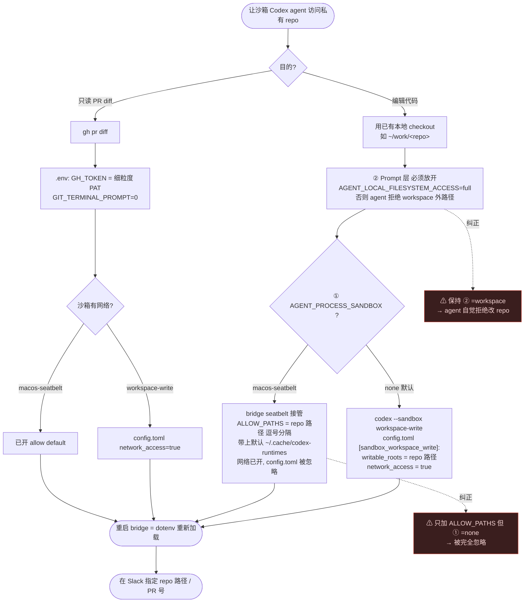

# Codex agent 私有 repo 访问 — 决策流程

配套 [[codex-agent-private-repo-access]] 的可视化。核心:**两层**(OS 沙箱层 + Prompt 自律层)必须同时对齐。

## 一句话记忆

- **② `AGENT_LOCAL_FILESYSTEM_ACCESS`** = agent 被*告知*能否碰本地文件 → 要改 repo 必须 `full`。
- **① `AGENT_PROCESS_SANDBOX`** = OS 真正的边界 → `ALLOW_PATHS` 只在 `macos-seatbelt` 有效;`none` 默认时用 config.toml 的 `writable_roots`。
- `~/.ssh` / Keychain 在沙箱内一律 deny → gh 走 `GH_TOKEN` env,git 操作放沙箱外。
