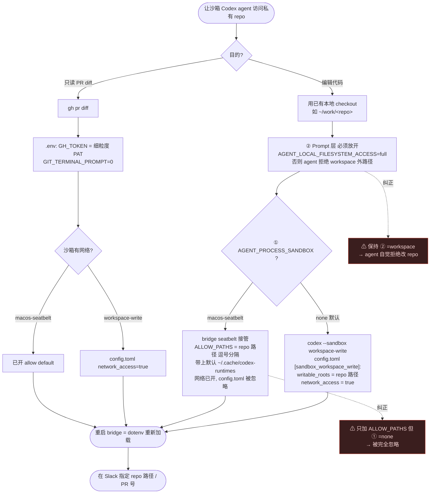

# 让沙箱里的 Codex agent 访问私有 GitHub repo(不改代码)

**场景**:`local-codex-agent`(Slack ↔ 本地 Codex 的 bridge)里,Codex 以沙箱身份跑,`git clone/fetch` 私有 repo 报:

```
fatal: could not read Username for 'https://github.com': Device not configured
```

**根因**:纯认证问题(网络其实是通的)。git 走 https 拿不到凭证,想在 `/dev/tty` 弹交互输入 → 沙箱无 TTY → 报 "Device not configured"。凭证拿不到的原因:

- gh 的 token 在 **macOS Keychain**,git 协议是 **ssh**,ssh key 在 `~/.ssh` —— 沙箱里 `$HOME` 子路径被 deny,这些全看不到。
- 环境里没有 `GH_TOKEN`。
- (若手动跑 `codex exec` 还把 `HOME=$PWD` 挪走,则连 gh 登录态/ssh key 一起藏没了。)

> 下文路径/org/repo 均为占位符:`~/work/<repo>`、`<org>/<repo>` 按自己的实际值替换。

---

## 关键前提:这是两个独立的层,别混

做对的核心是分清这两层由不同的 env 控制。

| 层 | 控制变量 | 作用 |
|---|---|---|
| **① 沙箱层(OS 强制)** | `AGENT_PROCESS_SANDBOX` | 决定用哪套沙箱,谁来放行文件/网络 |
| **② Prompt / 网关层(agent 自律)** | `AGENT_LOCAL_FILESYSTEM_ACCESS` | 决定 agent *被告知* 能不能碰本地文件 |

**② 是很多人踩的坑**:`AGENT_LOCAL_FILESYSTEM_ACCESS=workspace` 时,prompt 明确要求 agent *"只能碰本线程 workspace/artifacts,其他本地文件一律拒绝"*。就算沙箱在 OS 层放行了 repo 路径,agent 也会自觉拒绝。**要 agent 动手改本地 repo,② 必须设 `full`。**

沙箱层(①)的两套模式差别很大:

| `AGENT_PROCESS_SANDBOX` | 谁在管 | 可写目录靠什么 | 网络 | `AGENT_PROCESS_SANDBOX_ALLOW_PATHS` |
|---|---|---|---|---|
| `none`(**默认**) | codex 自己的 `--sandbox workspace-write` | config.toml `[sandbox_workspace_write] writable_roots` | 默认**关**(config 里 `network_access=true` 才开) | **被忽略** |
| `macos-seatbelt` | bridge 自己的 seatbelt(codex 被 `--dangerously-bypass-approvals-and-sandbox`) | `ALLOW_PATHS`(config.toml 此模式下**被忽略**) | **开**(profile 是 `allow default`) | **就是它** |

> `ALLOW_PATHS` 单加没用 —— 它只在 `macos-seatbelt` 模式生效,两者必须成对。

为什么 `.env` 能注入:bridge 是 `import "dotenv/config"`,`.env` 进 `process.env`;`buildAgentEnv()` 又 `{...process.env}` 传给子进程(只删 `SLACK_*` / `APPROVER_USER_IDS`)。所以往 `.env` 加东西 = 传给 Codex 子进程,无需改代码。

---

## 常见误区:「改一下 config.toml 就行了吧?」—— 不够

`config.toml` 只管**沙箱本身**(网络开不开、哪些目录可写),它**给不了凭证,也不会把 repo 放进空 workspace**。bot 读不到私有 repo,是下面三件缺一不可,而 config.toml 只能补其中一件:

| 缺口 | 靠什么补 | config.toml 搞得定? |
|---|---|---|
| ① 沙箱里没 GitHub 凭证(keychain / `~/.ssh` 被 deny) | `GH_TOKEN` 写进 **`.env`**(经 bridge 传给子进程) | ❌ 管不了 |
| ② workspace 是空的,没 repo checkout | clone 进 workspace,或 `writable_roots` 指向已有 checkout | 🔸 只做 writable_roots 那半,repo 本身还得在 |
| ③ workspace-write 默认不给联网(仅走 gh/git 联网读时才需要) | `[sandbox_workspace_write] network_access = true` | ✅ 就是它 |

结论:光调 config.toml,bot 依然读不到 —— 因为**没 token(①)、workspace 里也没代码(②)**。

**还有生效时机的坑**(常见的"我改了怎么没用"):

| 改哪 | 何时生效 | 要重启 bridge? |
|---|---|---|
| `~/.codex/config.toml` | **下次 `codex exec`**(`CODEX_IGNORE_USER_CONFIG=false` 时每次都读) | ❌ 不用 |
| `local-codex-agent/.env`(`GH_TOKEN`、`AGENT_PROJECT_ROOT`…) | 只在进程启动时被 `dotenv` 读一次 | ✅ **必须重启** |

> 若 bridge 是在改 `.env` 之前启动的,它仍跑旧 env(旧 workspace 路径 + 没有新加的 `GH_TOKEN`)—— 这经常才是"配置改了还是不行"的真凶。

---

## 方案 A:让 agent 改已有的本地 checkout(推荐,零 token 进沙箱)

前提:repo 已 clone 在本地(如 `~/work/<repo>`),你自己在沙箱外用 ssh 做 fetch/push,agent 只负责改文件。

**默认 `none` 模式** —— 改两处配置:

```toml
# ~/.codex/config.toml  (CODEX_IGNORE_USER_CONFIG=false 才会被读取)
[sandbox_workspace_write]
network_access = true
writable_roots = [
  "~/work/<repo>",
  "~/work/<mobile-repo>",
]
```

```bash
# local-codex-agent/.env
AGENT_LOCAL_FILESYSTEM_ACCESS=full
```

**或者「收紧版」`macos-seatbelt`**(想限制爆炸半径时用 —— `$HOME` 下除白名单全 deny,比 workspace-write 读权限还紧):

```bash
# local-codex-agent/.env  —— 此时不需要 config.toml 那段
AGENT_LOCAL_FILESYSTEM_ACCESS=full
AGENT_PROCESS_SANDBOX=macos-seatbelt
AGENT_PROCESS_SANDBOX_ALLOW_PATHS=~/.cache/codex-runtimes,~/work/<repo>,~/work/<mobile-repo>
```

- `ALLOW_PATHS` **逗号分隔**;**要带上默认值 `~/.cache/codex-runtimes`**(自定义会覆盖默认,漏了会丢 codex runtime 缓存路径)。

改完 **重启 bridge**(dotenv 只在启动读),再在 Slack 里告诉 agent:*在 `~/work/<repo>` 上工作、切对分支、不要 clone*。

## 方案 B:让 agent 自己读 PR diff(需要 token + 网络)

```bash
# local-codex-agent/.env
GH_TOKEN=<见下方 token 说明>
GIT_TERMINAL_PROMPT=0        # 拿不到凭证立刻失败,不再挂起
```

配合方案 A 打开的网络,agent 即可:`gh pr diff <PR号> --repo <org>/<repo>`。
`gh` 只要 env 有 `GH_TOKEN` 就直接用它、**忽略 keychain 和 HOME**(沙箱里 keychain 访问被 deny,所以必须走 env)。

## (可选)方案 C:在沙箱内 clone/fetch(HTTPS + token,不落盘)

```bash
# local-codex-agent/.env  —— 在 B 的基础上加
GIT_CONFIG_COUNT=1
GIT_CONFIG_KEY_0=credential.helper
GIT_CONFIG_VALUE_0=!f(){ echo username=x-access-token; echo "password=$GH_TOKEN"; };f
```

`GIT_CONFIG_COUNT/KEY_0/VALUE_0` 是 git ≥2.31 的纯 env 注入 config 机制,token 不写进 `.git/config`、不进 URL。但既然本地已有 checkout,优先方案 A。

---

## token 说明(`GH_TOKEN` 填什么)

- `gho_` 是 `gh auth login` OAuth 发的,**网页无法手动创建**;`gh auth token` 直接打印现有的(scope 通常很宽:`repo, admin:public_key, gist`)。
- 塞进沙箱建议用**细粒度 PAT**(`github_pat_`):`https://github.com/settings/personal-access-tokens/new` → Resource owner 选你的 org → Only select repositories → 权限最小化(读 diff:**Contents: Read + Pull requests: Read**;要 agent push 才给 Contents: Read and write)。
- org 挡住细粒度 PAT 时,fallback 经典 PAT(`ghp_`,scope 勾 `repo`;org 开了 SSO 记得 Authorize)。
- `GH_TOKEN` **不挑前缀**,三种都认。验证:`GH_TOKEN=<t> gh api repos/<org>/<repo> -q .full_name`。

---

## 坑 & 事实速查

- **`~/.ssh` / Keychain 在沙箱内都被 deny** → 沙箱里 git-over-ssh 用不了;gh 必须走 `GH_TOKEN` env。git 操作放沙箱外做。
- **`workspace-write` 能读全盘,但只写 workspace + `writable_roots` + tmp,网络默认关**。
- `AGENT_LOCAL_FILESYSTEM_ACCESS` 的网关硬拦只针对 `Downloads/Desktop/Documents/Library` 等关键词;`~/work/...` 不在硬拦名单,但 `workspace` 模式下 agent 会因 prompt 自觉拒绝。
- Codex `config.toml` sandbox key(从 0.142.5 二进制确认):`[sandbox_workspace_write]` 支持 `network_access`、`writable_roots`、`exclude_tmpdir_env_var`、`exclude_slash_tmp`。
- `CODEX_IGNORE_USER_CONFIG` 必须为 `false`,否则 config.toml / AGENTS.md 不加载。

## 决策流程

核心:**两层**(OS 沙箱层 + Prompt 自律层)必须同时对齐。



## 一句话记忆

- **② `AGENT_LOCAL_FILESYSTEM_ACCESS`** = agent 被*告知*能否碰本地文件 → 要改 repo 必须 `full`。
- **① `AGENT_PROCESS_SANDBOX`** = OS 真正的边界 → `ALLOW_PATHS` 只在 `macos-seatbelt` 有效;`none` 默认时用 config.toml 的 `writable_roots`。
- `~/.ssh` / Keychain 在沙箱内一律 deny → gh 走 `GH_TOKEN` env,git 操作放沙箱外。
