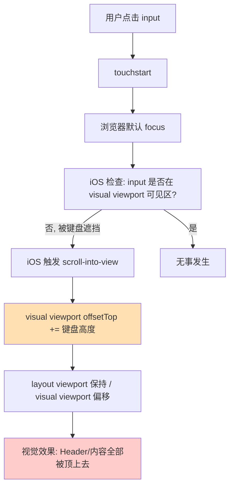
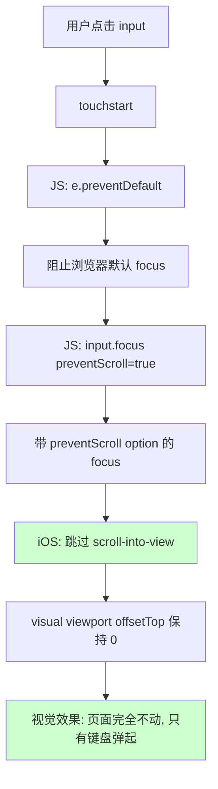
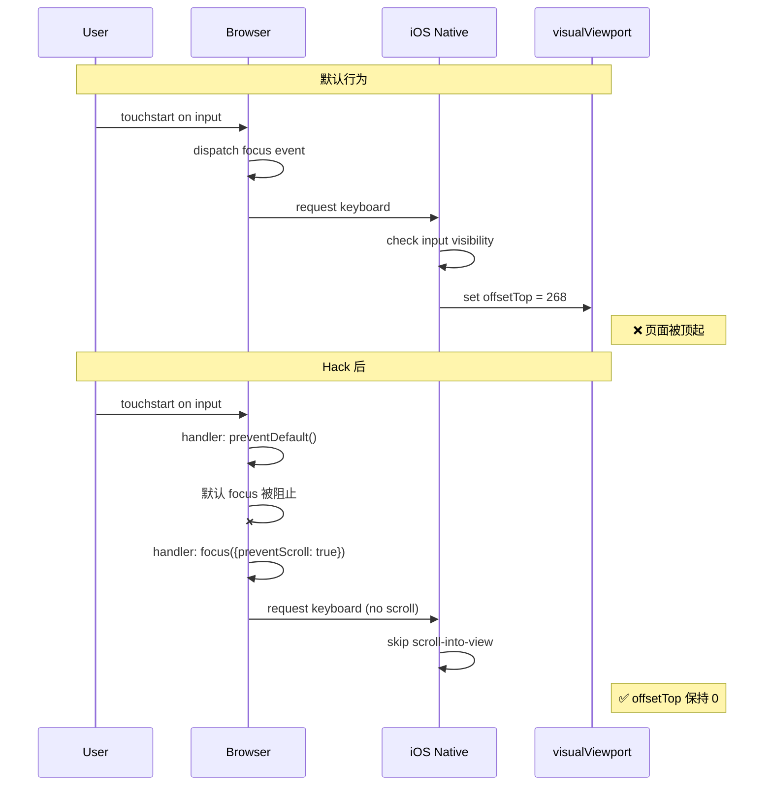

# iOS Safari 键盘 focus 流程图（默认 vs preventScroll hack）

## 默认行为（页面被顶上去）

```mermaid
flowchart TD
    A[用户点击 input] --> B[touchstart]
    B --> C[浏览器默认 focus]
    C --> D[iOS 检查: input 是否在 visual viewport 可见区?]
    D -->|否, 被键盘遮挡| E[iOS 触发 scroll-into-view]
    E --> F[visual viewport offsetTop += 键盘高度]
    F --> G[layout viewport 保持 / visual viewport 偏移]
    G --> H[视觉效果: Header/内容全部被顶上去]
    D -->|是| I[无事发生]

    style H fill:#ffcccc
    style F fill:#ffe0b3
```

## Hack 后（页面完全不动）

```mermaid
flowchart TD
    A[用户点击 input] --> B[touchstart]
    B --> C[JS: e.preventDefault]
    C --> D[阻止浏览器默认 focus]
    D --> E[JS: input.focus preventScroll=true]
    E --> F[带 preventScroll option 的 focus]
    F --> G[iOS: 跳过 scroll-into-view]
    G --> H[visual viewport offsetTop 保持 0]
    H --> I[视觉效果: 页面完全不动, 只有键盘弹起]

    style I fill:#ccffcc
    style G fill:#ccffcc
```

## 关键时序对比

```mermaid
sequenceDiagram
    participant U as User
    participant B as Browser
    participant iOS as iOS Native
    participant VV as visualViewport

    Note over U,VV: 默认行为
    U->>B: touchstart on input
    B->>B: dispatch focus event
    B->>iOS: request keyboard
    iOS->>iOS: check input visibility
    iOS->>VV: set offsetTop = 268
    Note right of VV: ❌ 页面被顶起

    Note over U,VV: Hack 后
    U->>B: touchstart on input
    B->>B: handler: preventDefault()
    B-xB: 默认 focus 被阻止
    B->>B: handler: focus({preventScroll: true})
    B->>iOS: request keyboard (no scroll)
    iOS->>iOS: skip scroll-into-view
    Note right of VV: ✅ offsetTop 保持 0
```

## Related

- [[ios-safari-keyboard-prevent-scroll]] — 主笔记：详细的解法与原理
