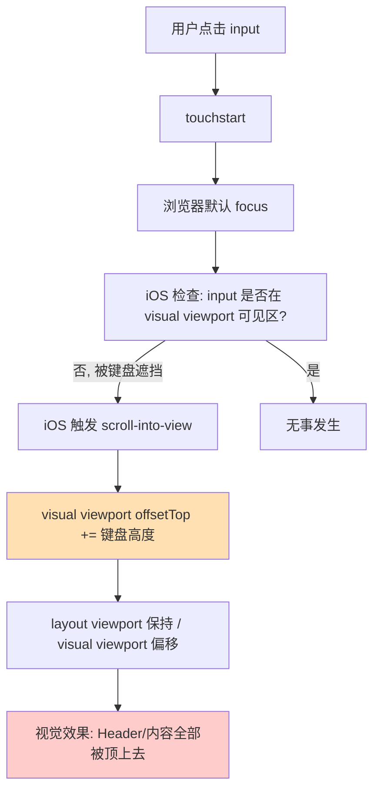
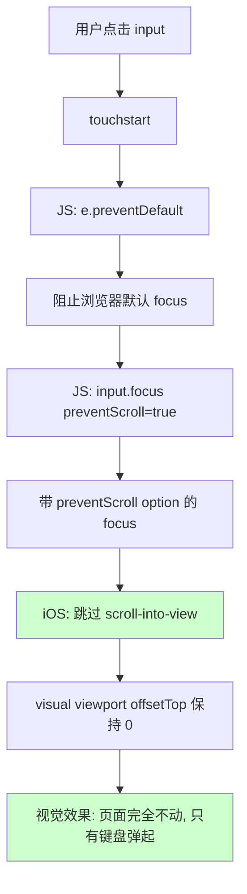
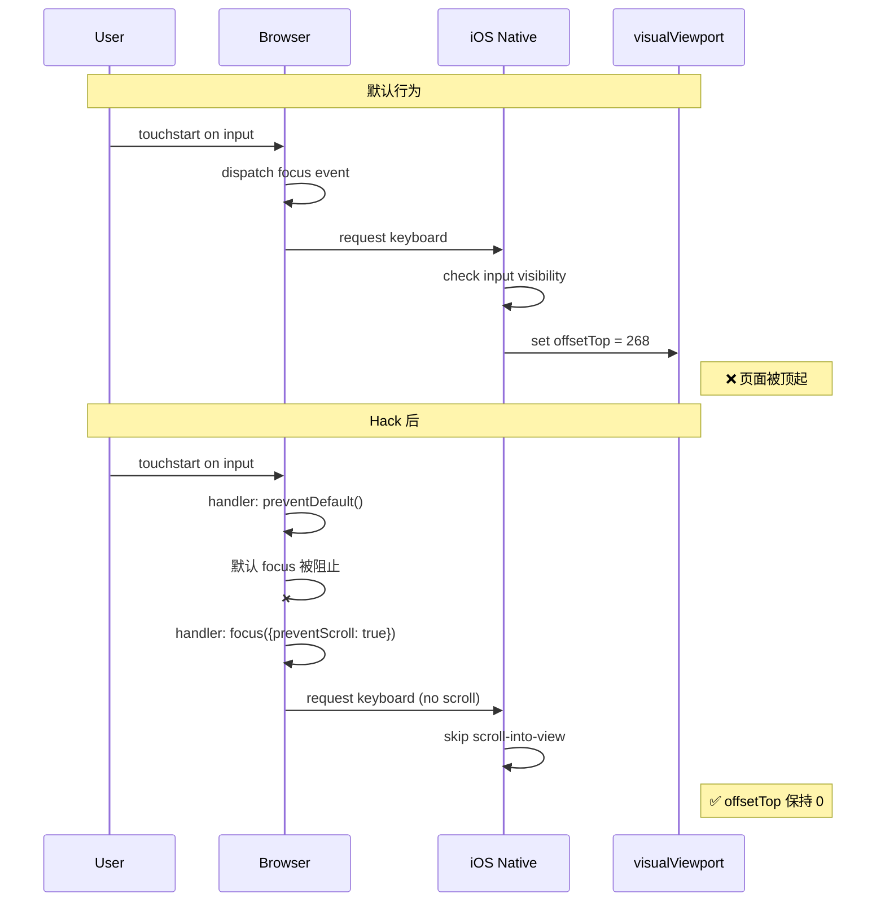

# iOS Safari 键盘弹起顶起页面的真正解法：preventScroll

## 问题

iOS Safari 中，`focus` 一个 `<input>` 或 `<textarea>` 时，如果输入框位于屏幕下半部（可能被虚拟键盘遮挡），iOS 会**自动把整个 layout viewport 向上偏移**（`visualViewport.offsetTop` 变成一个正数，通常 200-300px），让输入框"滚入"可见区。

**视觉表现**：
- 头部（header）被顶出屏幕上方
- 内容（blocks / 对话历史）跟着被向上推
- 即使用 `position: fixed` 也挡不住（fixed 元素跟 layout viewport 走，同样被偏移）

这是 iOS 8.2+ 的"自作聪明"行为，Android 不会这样。

## 试过但不 work 的方案

| 方案 | 失败原因 |
|---|---|
| `body.overflow: hidden` | 阻止不了 iOS 内部的 visual viewport 偏移 |
| `body.position: fixed` + 保存 scrollY | iOS 依然偏移 visual viewport |
| `100dvh` + flex column 布局 | iOS 不会立刻响应 dvh 变化，依然先触发偏移 |
| `overscroll-behavior: none` | 只管滚动，管不了 viewport 偏移 |
| `<meta name="viewport" content="... interactive-widget=resizes-content">` | iOS Safari **不支持**这个值（只是 Chrome Android 有效） |
| AlloyTeam 的 `.vv-root` + `transform: translate3d()` JS 同步 | 能"跟随"偏移（视觉上内容跟着移回），但有 1-2 帧 drift，header/内容会闪动 |

## 真正的解法

**核心 hack**：拦截 `touchstart`，阻止浏览器默认 focus，手动调用 `focus({ preventScroll: true })`。

```js
const input = document.getElementById('inp');
input.addEventListener('touchstart', (e) => {
  if (document.activeElement === input) return;   // 已 focus 跳过，避免递归
  e.preventDefault();                              // 阻止浏览器默认 focus 流程
  input.focus({ preventScroll: true });            // 手动 focus，但不 scroll
}, { passive: false });
```

## 为什么这能 work

- `focus({ preventScroll: true })` 是 **W3C 标准 option**（DOM Living Standard）
- 告诉浏览器 focus 元素时 **不要把它滚动到视口内**
- 这条路径下 iOS Safari **不会触发 scroll-into-view**，所以不偏移 visual viewport
- 最终 `visualViewport.offsetTop` 保持为 `0`，页面所有元素视觉位置不变
- 键盘依然正常弹起、输入正常（`focus()` 生效，只是跳过了"滚动到视口"这一步）

### 为什么不能直接用 `input.focus({ preventScroll: true })`

只对**代码触发的 focus** 生效。用户用手指点击 input 时，浏览器内部触发的 focus 不走这个 API，option 不起作用。

所以必须：
1. 在 `touchstart`（早于 focus）里 `preventDefault()`，阻止浏览器内部的 focus
2. 然后 JS 手动 `focus({ preventScroll: true })`，走带 option 的路径

## 关键细节

1. **`{ passive: false }`** 必须加，否则 `preventDefault()` 无效（Chrome/Safari 的 `passive: true` default）
2. **`if (document.activeElement === input) return`** 避免已 focus 时重复触发（否则键盘可能闪一下）
3. **不影响键盘的显示**：键盘照常弹起，只是页面不动
4. **兼容性**：iOS Safari 13+ 支持（`preventScroll` 和 `visualViewport` 都从 iOS 13 起）

## 对比 Google AI Mode

Google 的 AI mode（`https://www.google.com/search?udm=50&aep=11`）就是这样实现的 —— focus textarea 时页面完全不动，只有键盘从下方弹出。我们抓过它的 DOM/CSS，它的 `.y4VEUd` 容器 CSS 看似平平无奇，真正的魔法在**运行时 JS**（Closure 混淆后看不清）。猜测它用的就是这套 `touchstart` + `preventScroll` 的组合。

## 验证数据

| | 未加 hack | 加 hack 后 |
|---|---|---|
| `visualViewport.offsetTop` (focus 后) | 268 | **0** |
| Header 位置 | 被顶出屏幕 | 不动 |
| Block 内容 | 跟着上推 | 不动 |
| 输入栏 | 跟着键盘上方 | 跟着键盘上方 ✓ |

## 流程图

### 默认行为（页面被顶上去）



### Hack 后（页面完全不动）



### 关键时序对比




## Related

- [ios-safari-overscroll-textarea-caret](../react/ios-safari-overscroll-textarea-caret.md) — 相关：iOS Safari 弹性滚动导致 textarea caret 溢出
