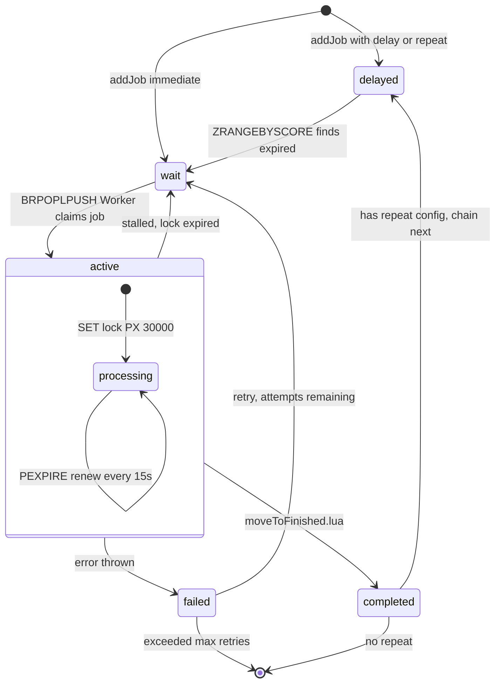
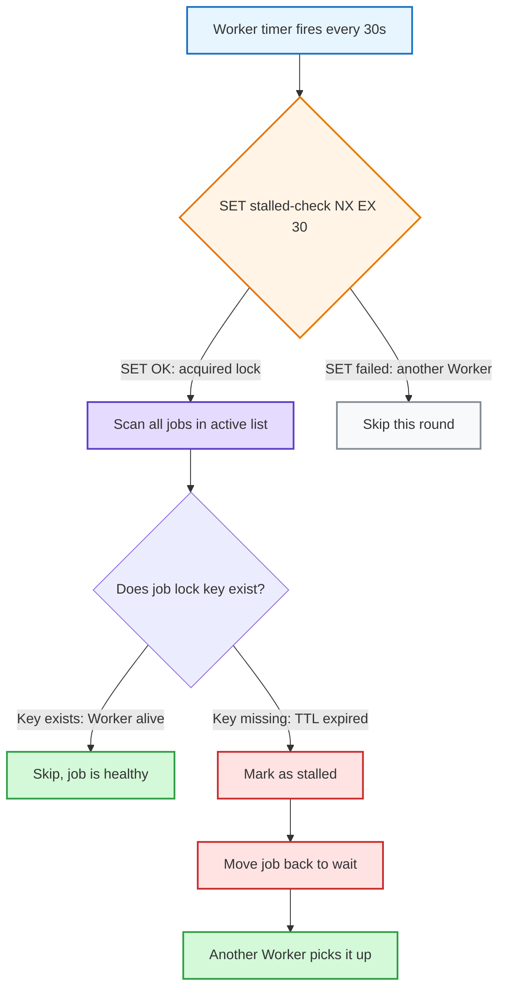
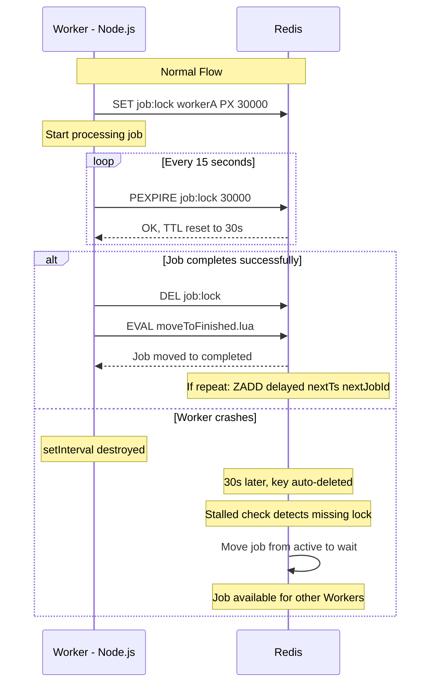

# BullMQ 流程图

配合 [[bullmq-internals]] 阅读。

## Job 生命周期状态机

```mermaid
stateDiagram-v2
    [*] --> delayed : addJob with delay or repeat
    [*] --> wait : addJob immediate

    delayed --> wait : ZRANGEBYSCORE finds expired

    wait --> active : BRPOPLPUSH Worker claims job

    state active {
        [*] --> processing : SET lock PX 30000
        processing --> processing : PEXPIRE renew every 15s
    }

    active --> completed : moveToFinished.lua
    active --> failed : error thrown
    active --> wait : stalled, lock expired

    failed --> wait : retry, attempts remaining
    failed --> [*] : exceeded max retries

    completed --> delayed : has repeat config, chain next
    completed --> [*] : no repeat
```

## Stalled Check 流程

```mermaid
graph TD
    A[Worker timer fires every 30s] --> B{SET stalled-check NX EX 30}

    B -->|SET OK: acquired lock| C[Scan all jobs in active list]
    B -->|SET failed: another Worker| Z[Skip this round]

    C --> D{Does job lock key exist?}

    D -->|Key exists: Worker alive| E[Skip, job is healthy]
    D -->|Key missing: TTL expired| F[Mark as stalled]

    F --> G[Move job back to wait]
    G --> H[Another Worker picks it up]

    style A fill:#e7f5ff,stroke:#1971c2,stroke-width:2px
    style B fill:#fff4e6,stroke:#e67700,stroke-width:2px
    style C fill:#e5dbff,stroke:#5f3dc4,stroke-width:2px
    style F fill:#ffe3e3,stroke:#c92a2a,stroke-width:2px
    style G fill:#ffe3e3,stroke:#c92a2a,stroke-width:2px
    style H fill:#d3f9d8,stroke:#2f9e44,stroke-width:2px
    style E fill:#d3f9d8,stroke:#2f9e44,stroke-width:2px
    style Z fill:#f8f9fa,stroke:#868e96,stroke-width:2px
```

## Lock 续期时序图

```mermaid
sequenceDiagram
    participant W as Worker - Node.js
    participant R as Redis

    Note over W,R: Normal Flow
    W->>R: SET job:lock workerA PX 30000
    Note over W: Start processing job

    loop Every 15 seconds
        W->>R: PEXPIRE job:lock 30000
        R-->>W: OK, TTL reset to 30s
    end

    alt Job completes successfully
        W->>R: DEL job:lock
        W->>R: EVAL moveToFinished.lua
        R-->>W: Job moved to completed
        Note over R: If repeat: ZADD delayed nextTs nextJobId
    else Worker crashes
        Note over W: setInterval destroyed
        Note over R: 30s later, key auto-deleted
        Note over R: Stalled check detects missing lock
        R->>R: Move job from active to wait
        Note over R: Job available for other Workers
    end
```

## Repeatable Job 链式流程

```mermaid
graph LR
    A1[delayed T1] --> B1[wait] --> C1[active] --> D1[completed]
    D1 --> E1[Lua: chain next]
    E1 --> A2[delayed T2] --> B2[wait] --> C2[active] --> D2[completed]
    D2 --> E2[Lua: chain next]
    E2 -.-> F[Round N ...]

    style A1 fill:#fff4e6,stroke:#e67700,stroke-width:2px
    style A2 fill:#fff4e6,stroke:#e67700,stroke-width:2px
    style B1 fill:#e7f5ff,stroke:#1971c2,stroke-width:2px
    style B2 fill:#e7f5ff,stroke:#1971c2,stroke-width:2px
    style C1 fill:#e5dbff,stroke:#5f3dc4,stroke-width:2px
    style C2 fill:#e5dbff,stroke:#5f3dc4,stroke-width:2px
    style D1 fill:#d3f9d8,stroke:#2f9e44,stroke-width:2px
    style D2 fill:#d3f9d8,stroke:#2f9e44,stroke-width:2px
    style E1 fill:#c5f6fa,stroke:#0c8599,stroke-width:2px
    style E2 fill:#c5f6fa,stroke:#0c8599,stroke-width:2px
    style F fill:#f8f9fa,stroke:#868e96,stroke-width:2px
```
