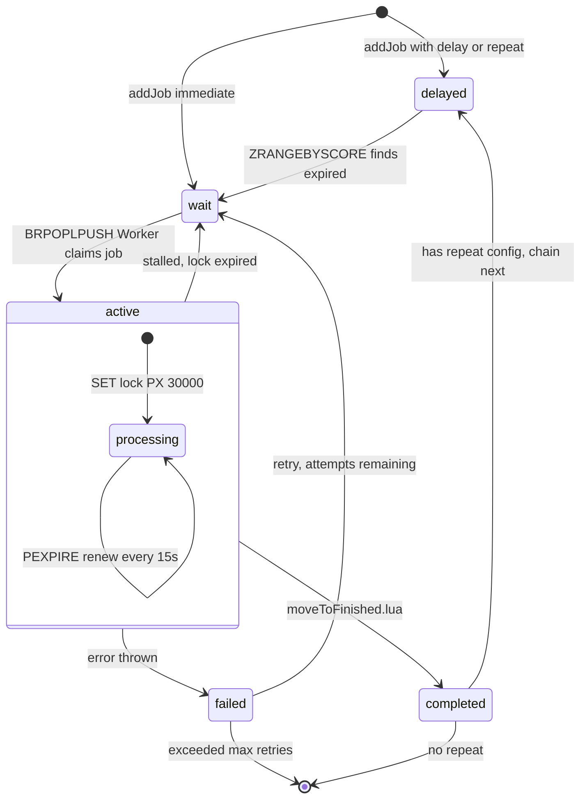
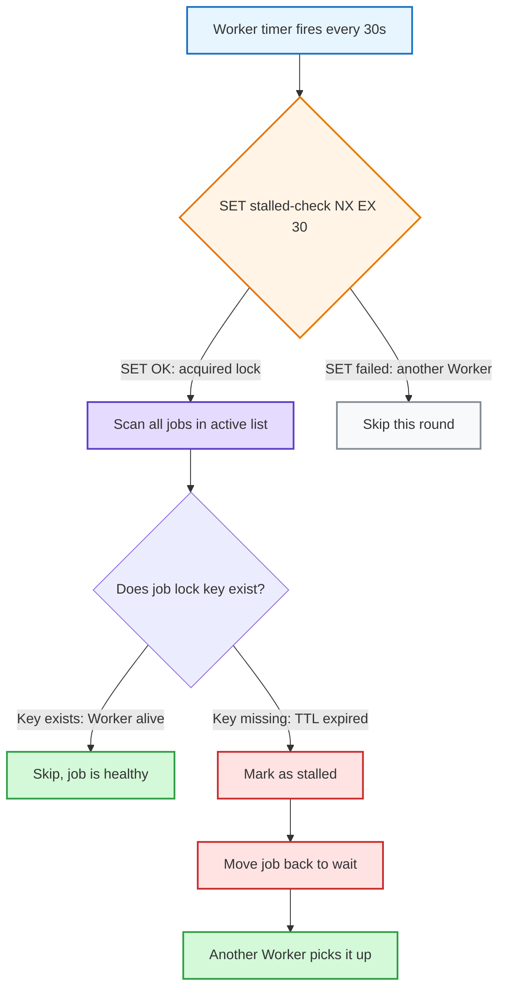
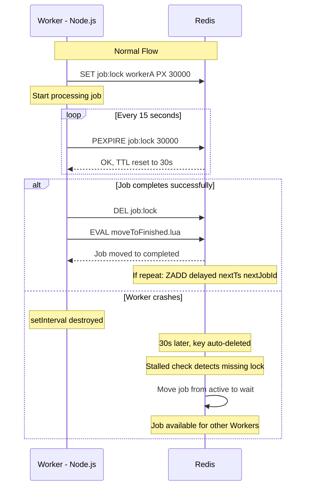

# BullMQ 底层实现原理

## 核心数据结构（全部基于 Redis）

| Redis 结构 | 用途 | Key 示例 |
|-----------|------|----------|
| **Hash** | 存储 job 数据（payload、状态、时间戳） | `bull:myqueue:jobId` |
| **Sorted Set (ZSET)** | 延迟队列、优先级队列、限流（按时间戳/优先级排序） | `bull:myqueue:delayed`、`bull:myqueue:prioritized` |
| **List** | 等待队列和处理中队列（FIFO） | `bull:myqueue:wait`、`bull:myqueue:active` |
| **Set** | 已完成/已失败的 job 集合 | `bull:myqueue:completed` |
| **Stream** | 事件通知（job 状态变化） | `bull:myqueue:events` |

## 队列操作原理

### 入队（addJob）
- 用 Lua 脚本原子操作：写 job 数据到 Hash + RPUSH 到 wait 列表（或 ZADD 到 delayed/prioritized ZSET）
- Lua 脚本保证原子性，不会出现半写状态

### 消费（processJob）
- Worker 用 `BRPOPLPUSH`（阻塞式）从 `wait` 列表弹出，同时推入 `active` 列表
- 原子操作——job 不会丢也不会被两个 worker 抢到

### 延迟任务
- ZADD 到 `delayed` ZSET，score 是执行时间戳
- 定时器轮询 ZRANGEBYSCORE 找到期的 job，移到 `wait` 列表

### 重试
- 失败后把 job 从 `active` 移回 `wait`（或 `delayed`，如果有 backoff）
- 重试次数记在 job 的 Hash 里

### 限流（Rate Limiting）
- 用 ZSET 记录时间窗口内的处理数量
- 超限时 job 暂存在 `limiter` ZSET，等窗口过了再放回

## Repeatable Jobs：链式延迟任务

调用 `queue.add(name, data, { repeat: { every: 5000 } })` 后：

1. BullMQ 在 Redis sorted set `bull:<queue>:repeat` 存一条 repeat 配置，然后创建第一个 **delayed job**
2. Worker 执行完后，Lua 脚本 `moveToFinished.lua` 原子地完成：移除 active job → 计算 `nextTimestamp = lastScheduled + every` → ZADD 到 `bull:<queue>:delayed`
3. Worker 定期 `ZRANGEBYSCORE` delayed set 找到期 job，移到 `wait` 队列执行

下次触发时间基于**上次应该触发的时间 + interval**（不是完成时间），避免累积漂移。

### 核心 Lua 脚本

**moveToActive.lua**（Worker 抢 job）：
- `ZRANGEBYSCORE delayed 0 <now>` 找到期 job
- `RPOPLPUSH wait active` 移到 active
- `SET lock` 标记 Worker 占用

**moveToFinished.lua**（Job 完成）：
- `DEL lock` 释放锁
- `ZREM active <job>` 移除
- 如果有 repeat 配置 → `ZADD delayed <nextTimestamp> <nextJobId>` 链式创建下一个

## Lock 机制与 Stalled Job 检测

BullMQ 里有两把锁，作用不同：

### Job Lock（每个 job 一把）

Worker 从 `wait` 拿到 job 后，在 Redis 设一个 key：

```
SET bull:myqueue:<jobId>:lock <workerId> PX 30000
```

- `PX 30000` = 30 秒过期
- 续期是 **BullMQ 的逻辑，不是 Redis**：Worker 在 Node.js 侧起一个 `setInterval` 定时器（默认每 `lockDuration / 2` 即 15 秒），回调里向 Redis 发 `PEXPIRE bull:myqueue:<jobId>:lock 30000` 重置 TTL
- Redis 只负责存 key 和到期删 key，不会主动续期——**Redis 是被动的钟表，BullMQ 是拨钟的人**
- **Worker 崩溃** → 定时器消失，没人续期 → 30 秒后 Redis 自动删除这个 key（TTL 到期）→ 这就是"lock 过期"

### Stalled Check Lock（全局一把）

```
SET bull:myqueue:stalled-check <workerId> NX EX 30
```

控制"谁来做 stalled 检查"：
- `NX` 保证同一时刻只有一个 Worker 执行检查（避免重复扫描）
- `<workerId>` 是 Worker 实例化时生成的唯一 ID，值本身不重要，关键是 `NX` 的互斥作用
- 如果负责检查的 Worker 也挂了 → 30s 后 `EX` 自动过期 → 其他 Worker 接管

### 完整流程

```
Worker A 拿到 job
  → SET bull:myqueue:123:lock workerA PX 30000    ← job lock
  → 续期... 续期... 💀 崩溃，不再续期
  → 30s 后 Redis 自动删除这个 key                  ← lock 过期

Worker B 定时执行 stalled check
  → SET bull:myqueue:stalled-check workerB NX EX 30  ← 抢到检查权
  → 扫描 active 列表里所有 job
  → 发现 job 123 的 lock key 不存在了（过期被删了）
  → 判定为 stalled → 移回 wait 重新执行
```

**"lock 过期"本质是 Redis key 的 TTL 到期被自动删除**——Redis 原生能力，不需要额外代码。BullMQ 利用这个特性检测 Worker 是否还活着：活着就续期，死了 key 就自然消失。

**结果**：repeat 链永远不会断——stalled job 被重新执行后正常触发 `moveToFinished.lua`，创建下一轮。

## 为什么全用 Lua 脚本

BullMQ 几乎所有操作都封装成 Redis Lua 脚本（`commands/` 目录下有几十个 `.lua` 文件）：
- **原子性**：多步操作不会被其他命令插入
- **性能**：一次网络往返完成整个操作，减少 RTT
- **一致性**：不需要分布式锁

## 流程图

### Job 生命周期状态机



### Stalled Check 流程



### Lock 续期时序图



### Repeatable Job 链式流程


## 关键设计总结

| 特性 | 实现 |
|------|------|
| 状态机 | Redis List（FIFO）+ Sorted Set（延迟/优先级）+ Hash（job 数据）+ Lua 脚本（原子操作） |
| 多 pod 安全 | Redis Lua 原子操作，只有一个 Worker 能拿到 job |
| 幂等去重 | repeat 配置用 `name + repeat options` 生成唯一 key |
| 崩溃恢复 | stalled check + lock TTL，无单点故障 |
| 不漂移 | 基于 scheduled time 而非 completion time 计算下次触发 |
