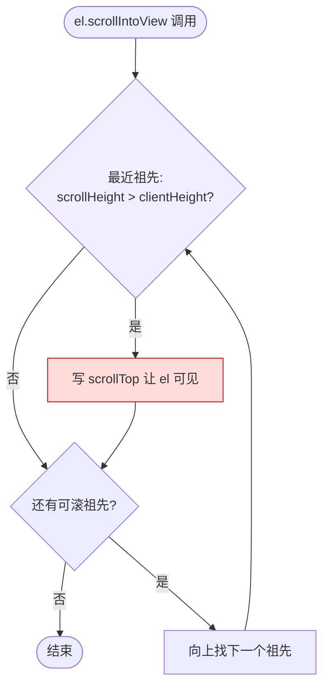
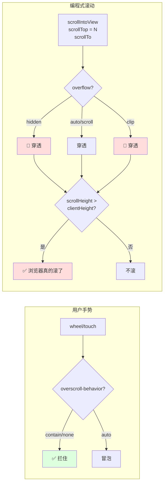

# scrollIntoView 祖先冒泡图

伴随 [[scrollintoview-ancestor-leak]] 的可视化。

## 调用时浏览器做了什么



**关键**：判定可滚只看 `scrollHeight > clientHeight`，**不看 `overflow`**。`overflow: hidden` 的元素也会进入循环。

## 我遇到的真实错位路径

```mermaid
sequenceDiagram
    participant M as messagesEndRef
    participant MC as messagesContainer<br/>(overflow-y: auto)
    participant CP as ChatPanel<br/>(overflow: hidden)
    participant CA as ContentArea<br/>(overflow: hidden)
    participant Main as &lt;main&gt;<br/>(overflow-y: auto)

    Note over M,Main: messages 溢出到 ChatPanel, <br/>ChatPanel.scrollHeight = 4062

    M->>MC: scrollIntoView()
    MC->>MC: scrollTop = 3660 (滚到底)
    Note over MC: messages 还有剩余不可见<br/>(因为内容超出 ChatPanel 盒子)
    MC->>CP: 继续向上滚
    CP->>CP: scrollTop = 711 ❌<br/>(overflow:hidden 挡不住)
    Note over CP: 整个 chat 被推上 711px
    CP->>CA: 继续向上?
    CA-->>CA: scrollHeight == clientHeight<br/>止步
```

## 三种"保护"的真实作用



结论：**`overflow-hidden` 和 `overscroll-contain` 是两个不同维度的限制** —— 一个管可见性、一个管用户手势冒泡，两个都不管编程式 scroll。
